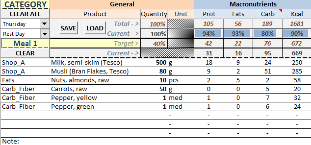

# DietPlanner
An Excel sheet that can calculate micro/macro nutrients for a healthier lifestyle.

You need to enable macros to use it effectively.

Some of the functions inside are coded using Visual Basic.

# How to Use
With the button "Clear All" you can clear all data in all days.

Under it there are 2 dropdown lists that specify Weekday and Activity.

On the right there are 2 buttons "Save" and "Load", which save or load all changes to the Planner sheet for the chosen day and activity level.

Under "Meal 1" there is a button "Clear" that can clear the whole plan for that meal in the current sheet.

You can add new foods by selecting the category from the dropdown sheet from row 7 to row 16 and so on for each meal. After you have selected a category, you can choose a food from that category in the right cell, then a quantity in the next cell. Other data will be loaded and calculated automatically.

The last row in each meal is a Note that you can fill. It will be saved to the planner, but it might not look good on print.

## Planner
On the Planner sheet

## Configuration
First go to Settings, review and input your own body measurements.

Specify Rest and Active day "Diet Type" and "Activity Level" (some cells have comments for further details).

> NOTE: Values that should be edited by the user are colored in orange.

Calorie intake values are deducted from several popular formulas, then the average is used and applied to the worksheet.

Edit your macros by changing the percentage in the orange areas. Make sure it adds to 100% in all 3 cells per row.

## Copyright
Note that I have retrieved nutritional information for different products from different websites, some of which ban commercial use. 

What you do with the data is your responsibility.
## Data Sources
http://nutritiondata.self.com/

https://wikipedia.org/
## Warning
I am no dietician nor do I guarantee that there are no errors in the program. This is something I made for myself, use at your own risk.

## Adding Products (Simple)
To add a product, go to the category sheet, copy the last row that contains a valid entry and paste it on the row below. Edit its values.

The entry will be automatically added to the dropdown lists.

## Adding Recipes (Complex)
To add a new recipe, first go to RecipeGen, then find the last recipe entry. Copy all from the white box in its top left corner to the last cell in its bottom right corner (which is water value). Paste the new values under it.

After pasting, feel free to edit the name, add foods, etc.

On completion, select the cells starting from the cell after "Copy from ->" and ending with the last cell (water nutrition). Go to Recipes tab and and use PASTE LINK on the last empty row.

Now the recipe should appear in dropdown lists in the Recipe category.
