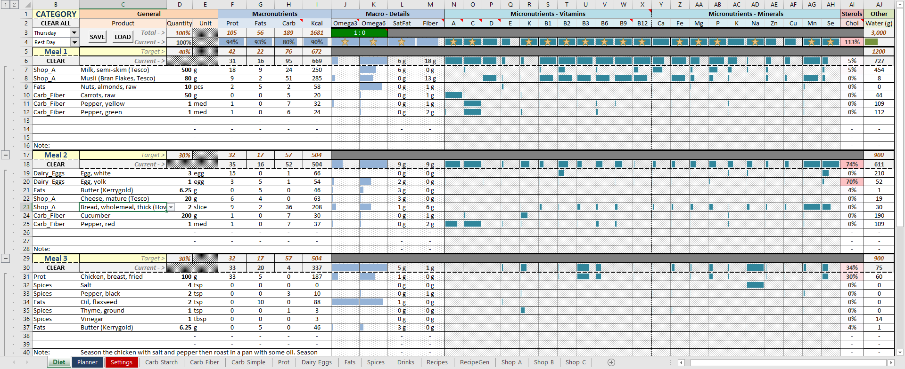
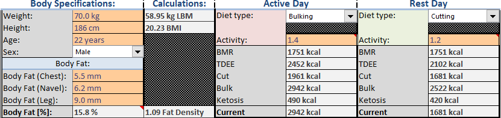
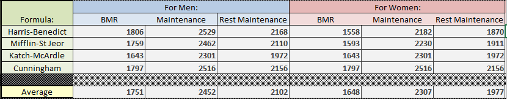
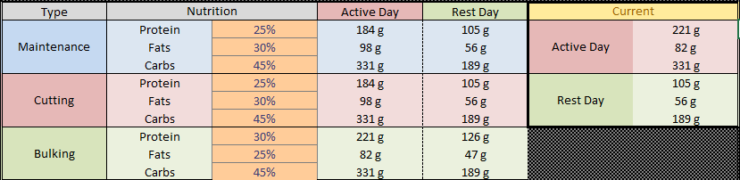

# DietPlanner
An Excel sheet that can calculate micro/macro nutrients for a healthier lifestyle.

You need to enable macros to use it effectively.

Some of the functions inside are coded using Visual Basic.

## How to Use
First go to Settings, review and input your own body measurements.

Specify Rest and Active day "Diet Type" and "Activity Level" (some cells have comments for further details).

NOTE: Values that should be edited by the user are colored in orange.

Calorie intake values are deducted from several popular formulas, then the average is used and applied to the worksheet.

Edit your macros by changing the percentage in the orange areas. Make sure it adds to 100% in all 3 cells per row.

## Copyright
Note that I have retrieved nutritional information for different products from different websites, some of which ban commercial use. 

What you do with the data is your responsibility.
## Data Sources
http://nutritiondata.self.com/

https://wikipedia.org/
## Warning
I am no dietician nor do I guarantee that there are no errors in the program. This is something I made for myself, use at your own risk.

## Adding Products
To add a product, go to the category sheet, copy the last row that contains a valid entry and paste it on the row below.

## Adding Recipes
To add a new recipe, first go to RecipeGen, then find the last recipe entry. Copy all from the white box in its top left corner to the last cell in its bottom right corner (which is water value). Paste the new values under it.
